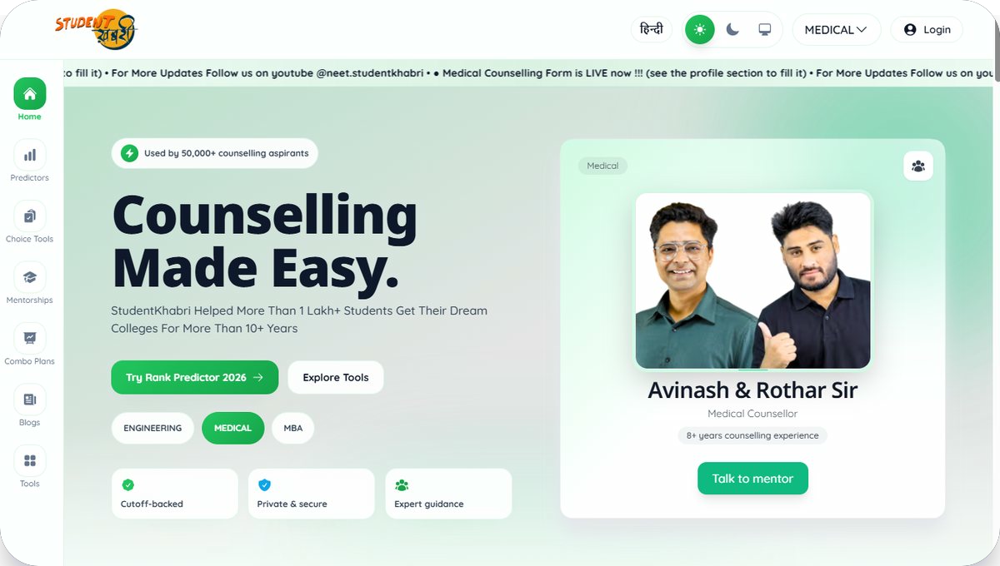
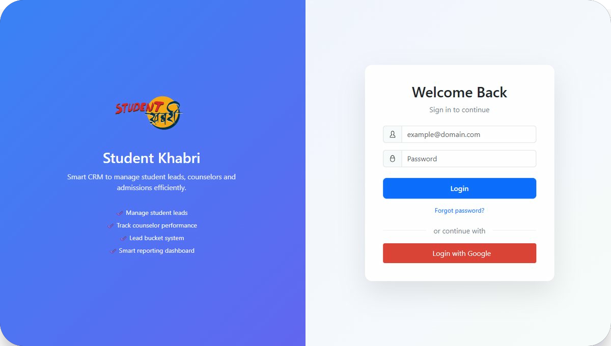
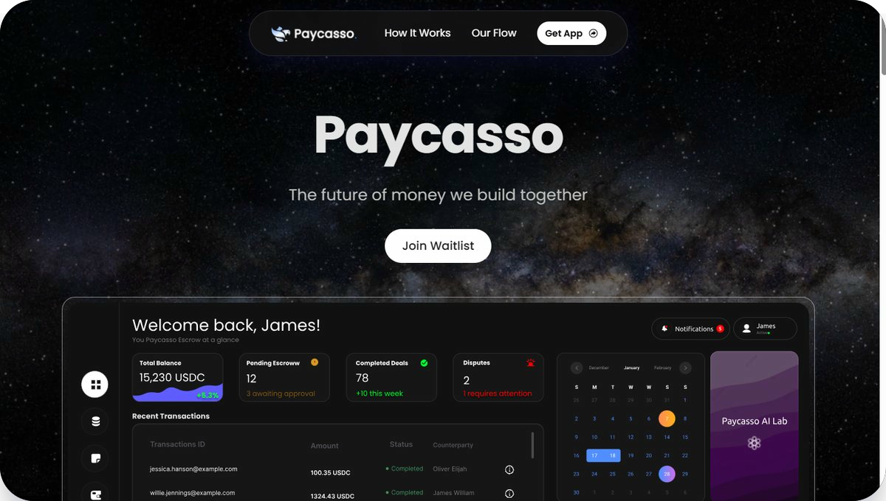

  

  <strong>Building production-grade EdTech, CRM and FinTech platforms.</strong>

  

  
  
  
  

  
  
  

---

## About Me

I am a **Software Engineer** , building scalable products across EdTech, CRM and FinTech domains.

- Currently working on **Student Khabri**, a live counselling and admissions platform.
- Building **Student Khabri CRM** with lead management, reporting, notifications, permissions and workflow automation.
- Worked on **Paycasso**, a FinTech platform focused on secure transaction workflows and production frontend architecture.
- Interested in **Backend Engineering**, **System Design**, **Scalable APIs**, **Database Design**, **Payment Systems**, **CRM Automation** and **large-scale web applications**.

  
  
  

---

## Experience

<table>
  <tr>
    <td width="28%" valign="top">
      <strong>Student Khabri</strong> 
      Junior Software Developer
    </td>
    <td valign="top">
      <ul>
        <li>Developed production-ready features for a live counselling platform.</li>
        <li>Built predictor tools, college finder modules and profile analysis systems.</li>
        <li>Integrated Razorpay payments and implemented dynamic forms.</li>
        <li>Developed CRM workflows, admin dashboard features and optimized business workflows.</li>
      </ul>
    </td>
  </tr>
  <tr>
    <td width="28%" valign="top">
      <strong>Student Khabri CRM</strong> 
      Production CRM System
    </td>
    <td valign="top">
      <ul>
        <li>Built lead management, notifications, reporting and workflow automation.</li>
        <li>Implemented role-based permissions and webhook processing.</li>
        <li>Designed CRM flows for sales, counselling and internal operations.</li>
      </ul>
    </td>
  </tr>
  <tr>
    <td width="28%" valign="top">
      <strong>Paycasso</strong> 
      FinTech Platform
    </td>
    <td valign="top">
      <ul>
        <li>Worked on secure payment workflows and production frontend development.</li>
        <li>Integrated APIs and built scalable user-facing platform modules.</li>
      </ul>
    </td>
  </tr>
</table>

---

## Featured Projects

<table>
  <tr>
    <td width="36%" valign="top">
      
    </td>
    <td valign="top">
      <h3>Student Khabri</h3>
      
<strong>Live EdTech Platform</strong>

      
Large-scale counselling platform featuring predictors, college finder, payment systems, mentorship, analytics, admin panel, blogs and dynamic workflows.

      

        
        
        
        
        
        
      

      

        
        
      

    </td>
  </tr>
  <tr>
    <td width="36%" valign="top">
      
    </td>
    <td valign="top">
      <h3>Student Khabri CRM</h3>
      
<strong>Production CRM Platform</strong>

      
CRM system with lead management, notifications, reports, permissions, webhooks and workflow automation for operational teams.

      

        
        
        
        
        
      

      

        
        
      

    </td>
  </tr>
  <tr>
    <td width="36%" valign="top">
      
    </td>
    <td valign="top">
      <h3>Paycasso</h3>
      
<strong>Production FinTech Platform</strong>

      
Secure transaction platform focused on API integrations, payment workflows and scalable frontend architecture.

      

        
        
        
        
      

      

        
        
      

    </td>
  </tr>
</table>

---

## Other Projects

| Project       | Type                        | Live                                                    |
| ------------- | --------------------------- | ------------------------------------------------------- |
| devTinder     | Developer networking app    | [Open](https://devtinder-frontchaserashwin.vercel.app/) |
| ChaserCart    | E-commerce website          | [Open](https://chaser-cart-frontend.vercel.app/)        |
| BookIt        | Experience booking platform | [Open](https://bookit-frontend-smoky.vercel.app/)       |
| Event0        | Event management platform   | [Open](https://event0-frontend.vercel.app/)             |
| Linker        | Social media website        | [Open](https://linker-one-chi.vercel.app/)              |
| YouTube Clone | Streaming UI clone          | [Open](https://youtube-chaserashwin.vercel.app/)        |

---

## Tech Stack

**Frontend**

  
  
  
  
  
  

**Backend**

  
  
  
  
  
  

**Database**

  
  
  

**Cloud & Deployment**

  
  
  
  

**Tools**

  
  

**Integrations**

  
  
  
  

---

## Achievements

- Flutter Fest Winner.
- Hacktoberfest Participant.
- Production deployments across live platforms.
- Experience building enterprise CRM workflows.

---

## GitHub Metrics

  
  

  

---

## Current Focus

<table>
  <tr>
    <td width="50%" valign="top">
      <strong>Currently Working On</strong>
      <ul>
        <li>Student Khabri</li>
        <li>Student Khabri CRM</li>
      </ul>
    </td>
    <td width="50%" valign="top">
      <strong>Learning</strong>
      <ul>
        <li>Advanced Next.js</li>
        <li>Laravel</li>
        <li>System Design</li>
        <li>PostgreSQL</li>
      </ul>
    </td>
  </tr>
</table>

---

## Connect

  <strong>Open to Full Stack Developer opportunities.</strong>

  
  
  
  

  From <a href="https://github.com/Chaserashwin">Chaserashwin</a>

